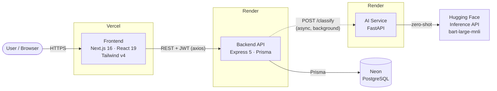

# Triage (AI-Powered Bug Management)

Triage is a collaborative bug-tracking platform that classifies incident severity
automatically. Report a bug in plain language and a AI model labels it
**High**, **Normal**, or **Low** in the background, so the board stays prioritized
without anyone triaging by hand.

> **Status:** Core flows (auth, workspaces, bug reporting, AI classification,
> comments, list/kanban views) are live. A frontend polish pass — themed
> toasts/dialogs on the bug board, in-place bug edit/reopen, and activity
> polling — is in progress. The REST API already supports all of these.

---

## Architecture

Triage is three deployable services plus a managed database and an external
inference API:




## Tech Stack

| Layer | Technology |
|-------|-----------|
| **Frontend** | Next.js 16 (App Router), React 19, TypeScript, Tailwind CSS v4, Framer Motion, Recharts, lucide-react, axios |
| **Backend** | Node.js, Express 5, Prisma 5, JWT (`jsonwebtoken`), `bcrypt`, `express-rate-limit`, CORS |
| **AI Service** | Python, FastAPI, Uvicorn — proxies Hugging Face zero-shot classification (`facebook/bart-large-mnli`) |
| **Database** | PostgreSQL (Neon serverless) |
| **Hosting** | Frontend → Vercel · Backend & AI → Render

## How It Works

**Authentication.** Registration is explicit (`/auth/register`); logging in never
silently creates an account, so a typo'd email fails loudly instead of stranding
you in a new empty workspace. Passwords are bcrypt-hashed with an 8-character
minimum. Credential and join endpoints are rate-limited.

**Workspaces.** Each workspace has a 6-character access key for others to join,
and an **owner** (its creator). Only the owner can delete a workspace; other
members can leave. If an owner leaves, ownership passes to the earliest remaining
member; an emptied workspace is cleaned up rather than orphaned.

**Bug lifecycle.** Report → saved as `Pending` → AI classifies in the background →
severity updated (`High`/`Normal`/`Low`), or left `Pending` for manual setting if
the model is unreachable. Bugs can be resolved, reopened, edited, commented on,
and deleted. Every action is written to a per-workspace activity feed.

**Sample workspace.** A static, read-only demo workspace with 10 example bugs is
shown to new users as a display case. It makes no API calls and can't be
modified.

---

## API Reference

All `/dashboards` and `/bugs` routes require an `Authorization: Bearer <token>`
header. Membership is enforced server-side on every workspace and bug.

| Method | Route | Description |
|--------|-------|-------------|
| `POST` | `/auth/register` | Create an account (rate-limited) |
| `POST` | `/auth/login` | Log in (rate-limited) |
| `GET` | `/dashboards` | List the caller's workspaces |
| `POST` | `/dashboards` | Create a workspace (caller becomes owner) |
| `GET` | `/dashboards/:id` | Workspace detail + members + recent activity |
| `POST` | `/dashboards/join` | Join by access key (rate-limited) |
| `DELETE` | `/dashboards/:id` | Delete a workspace (owner only) |
| `POST` | `/dashboards/:id/leave` | Leave a workspace |
| `GET` | `/dashboards/:id/bugs` | List bugs (with comments) |
| `POST` | `/bugs` | Report a bug — returns `202`, classifies async |
| `PATCH` | `/bugs/:id` | Edit title/description/severity |
| `PATCH` | `/bugs/:id/resolve` | Mark resolved |
| `PATCH` | `/bugs/:id/reopen` | Reopen |
| `DELETE` | `/bugs/:id` | Delete a bug and its comments |
| `POST` | `/bugs/:id/comments` | Add a comment |
| `GET` | `/health` | Liveness check |

The AI service exposes `POST /classify` (`{ title, description }` →
`{ severity }`) and `GET /health`.

---

## Data Model

```
User ──< owns >── Dashboard          User >──< Dashboard   (membership, many-to-many)
                     │
                     ├──< Bug ──< Comment >── User
                     └──< Activity

Bug.severity ∈ { Pending, High, Normal, Low }
Bug.status   ∈ { OPEN, RESOLVED }
```

See [`Backend/prisma/schema.prisma`](Backend/prisma/schema.prisma) for the full
schema.

---

## Deployment

| Service | Platform | Notes |
|---------|----------|-------|
| Frontend | Vercel | Set `NEXT_PUBLIC_API_URL` to the backend's public URL |
| Backend | Render | Add the backend `.env` vars; add the frontend origin to CORS `allowedOrigins` in `Backend/src/index.ts` |
| AI Service | Render | Set `HF_TOKEN`; start with `uvicorn app.main:app --host 0.0.0.0 --port $PORT` |
| Database | Neon | Use the pooled connection string as `DATABASE_URL` |

Free-tier Render services sleep when idle and take ~30–50s to wake — the UI
surfaces a warning during that cold start.
